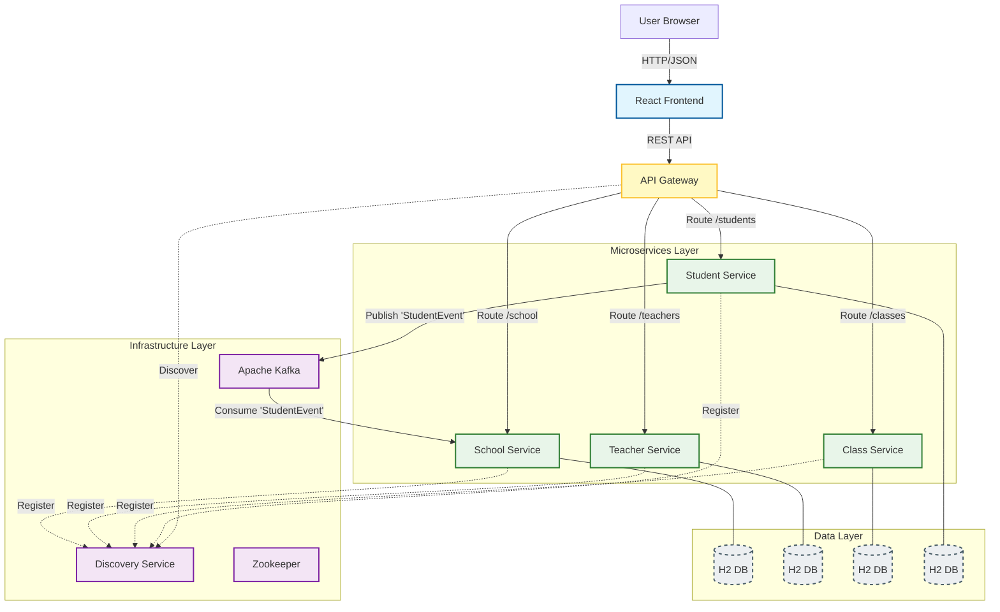

# School Management System

A modern, full-stack web application designed to streamline school administration. This system allows for efficient management of schools, teachers, classes, and students through a premium, user-friendly interface.

## 🚀 Introduction

The **School Management System** is built with a robust **Spring Boot** backend (Microservices Architecture) and a dynamic **React** frontend. It features a clean, responsive design with secure authentication, real-time data visualization, and comprehensive CRUD capabilities for all administrative tasks.

## ✨ Features

-   **🔐 Authentication**: Secure login system with a dedicated, branded login page.
-   **📊 Dashboard**: Real-time overview with statistics and a "Students per Class" bar chart.
-   **🏫 School Management**: Update and maintain essential school details.
-   **👨‍🏫 Teacher Management**: Register and view teacher profiles.
-   **📚 Class Management**: Organize classes and assign teachers.
-   **🎓 Student Management**: Register students and track their class enrollments.
-   **🎨 Premium UI/UX**: Glassmorphism design, smooth animations, and responsive layout.

## 🏗️ Architecture



## 🛠️ Tech Stack

### Frontend
-   **Framework**: React (Vite)
-   **Language**: TypeScript
-   **Styling**: Custom CSS Variables (Tailwind-like utility classes), Lucide React Icons
-   **Charting**: Recharts
-   **Routing**: React Router DOM

### Backend (Microservices)
-   **Framework**: Spring Boot 3.2.0
-   **Architecture**: Microservices with Netflix Eureka & Spring Cloud Gateway
-   **Service Discovery**: Netflix Eureka Server
-   **API Gateway**: Spring Cloud Gateway
-   **Security**: Spring Security (Basic Auth)
-   **Messaging**: Apache Kafka (Async Communication)
-   **Language**: Java 17
-   **Database**: H2 Database (In-Memory, separate for each service)
-   **ORM**: Spring Data JPA
-   **Build Tool**: Maven

## 📂 Project Structure

```
school-management/
├── backend/
│   ├── discovery-service/  # Port 8761 (Eureka Server)
│   ├── api-gateway/        # Port 8080 (API Gateway)
│   ├── school-service/     # Port 8081
│   ├── teacher-service/    # Port 8082
│   ├── class-service/      # Port 8083
│   └── student-service/    # Port 8084
├── frontend/               # React Application (Port 5173)
├── docker-compose.yml      # Kafka & Zookeeper Infrastructure
└── README.md               # Project Documentation
```

## ⚙️ Installation & Running

### Prerequisites
-   **Node.js** (v16 or higher)
-   **Java Development Kit (JDK)** (v17 or higher)
-   **Maven** (Optional, wrapper included in standard projects but manual install used here)
-   **Docker Desktop** (Required for Kafka)

### 1. Backend Setup (Microservices)

You need to start the **Kafka Infrastructure** first, then **Discovery Service**, **API Gateway**, and finally the 4 microservices. Open 7 separate terminal windows:

**Terminal 1 (Kafka & Zookeeper):**
```powershell
docker-compose up -d
```

**Terminal 2 (Discovery Service - 8761):**
```powershell
cd backend/discovery-service
$env:JAVA_HOME="C:\Program Files\Java\jdk-21"; mvn spring-boot:run
```

**Terminal 3 (API Gateway - 8080):**
```powershell
cd backend/api-gateway
$env:JAVA_HOME="C:\Program Files\Java\jdk-21"; mvn spring-boot:run
```

**Terminal 4 (School Service - 8081):**
```powershell
cd backend/school-service
$env:JAVA_HOME="C:\Program Files\Java\jdk-21"; mvn spring-boot:run
```

**Terminal 5 (Teacher Service - 8082):**
```powershell
cd backend/teacher-service
$env:JAVA_HOME="C:\Program Files\Java\jdk-21"; mvn spring-boot:run
```

**Terminal 6 (Class Service - 8083):**
```powershell
cd backend/class-service
$env:JAVA_HOME="C:\Program Files\Java\jdk-21"; mvn spring-boot:run
```

**Terminal 7 (Student Service - 8084):**
```powershell
cd backend/student-service
$env:JAVA_HOME="C:\Program Files\Java\jdk-21"; mvn spring-boot:run
```

### 2. Frontend Setup (React)

The frontend runs on port `5173`.

> [!IMPORTANT]
> **Login Credentials**:
> - **Username**: `admin`
> - **Password**: `password`

1.  Open a new terminal and navigate to the frontend directory:
    ```bash
    cd frontend
    ```
2.  Install dependencies:
    ```bash
    npm install
    ```
3.  Start the development server:
    ```bash
    npm run dev
    ```

## 🌐 Usage

1.  Ensure all 4 Backend Services, Discovery Service, and API Gateway are running.
2.  Open your browser and visit `http://localhost:5173`.
3.  Log in with the credentials:
    -   **Username**: `admin`
    -   **Password**: `password`
4.  Navigate through the sidebar to manage different aspects of the school.

## 🤝 Contributing

Contributions are welcome! Please fork the repository and submit a pull request.

---
*Developed by [Bhaumiksinh](https://github.com/bhaumiksinh)*
