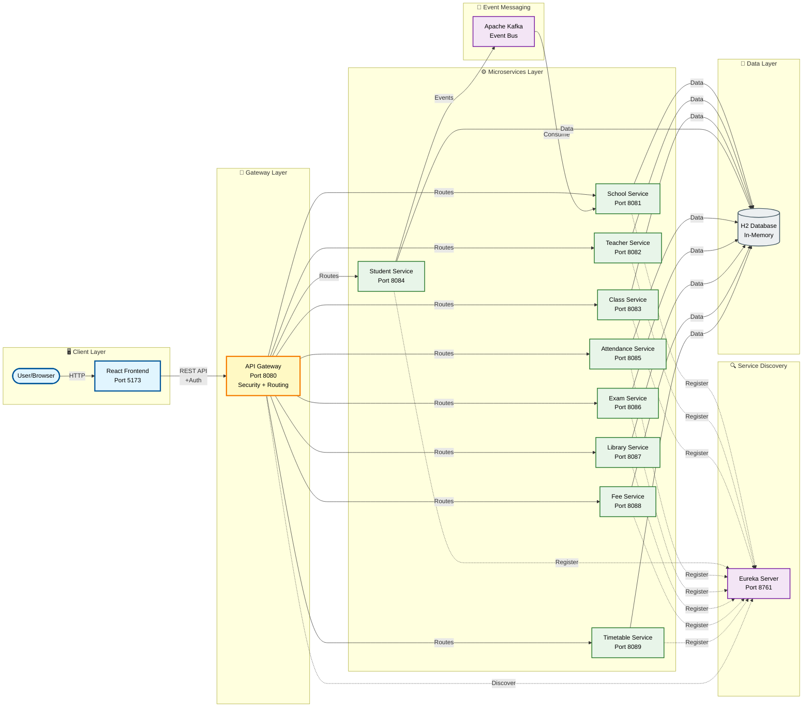
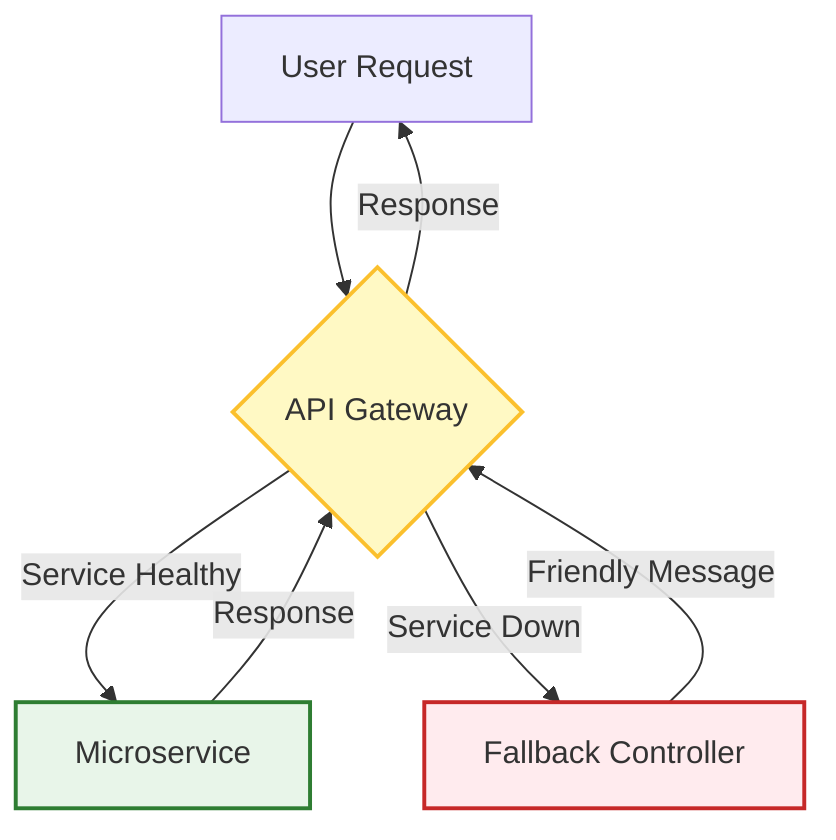

# 🎓 School Management System


A modern, full-stack web application designed to streamline school administration. Built with a **Microservices Architecture**, this system ensures scalability, fault tolerance, and a premium user experience.

---

## 📑 Table of Contents
- [Introduction](#-introduction)
- [Features](#-features)
- [Architecture](#-architecture)
- [Tech Stack](#-tech-stack)
- [Fault Tolerance](#-fault-tolerance--resilience)
- [Project Structure](#-project-structure)
- [Installation & Running](#-installation--running)
- [Usage](#-usage)
- [Contributing](#-contributing)

---

## 🚀 Introduction

The **School Management System** leverages the power of **Spring Boot** and **React** to provide a comprehensive solution for educational institutions. It moves beyond monolithic limitations by adopting a distributed microservices approach, ensuring that each component (School, Teacher, Class, Student) operates independently yet cohesively.

## ✨ Features

### 🖥️ Core Modules
-   **🔐 Secure Authentication**: Centralized security via API Gateway using Spring Security (Basic Auth).
-   **📊 Interactive Dashboard**: Real-time analytics with visual charts and quick action shortcuts.
-   **🏫 School Management**: Comprehensive CRUD for managing school details, including name, address, and contact info.
-   **👨‍🏫 Teacher Management**: Register and manage teacher profiles, assigning them to specific schools.
-   **📚 Class Management**: Organize classes, assign teachers, and manage student capacity.
-   **🎓 Student Management**: Register students, track enrollments, and view detailed student profiles.
-   **📅 Attendance Management**: Track daily student attendance and generate reports.
-   **📝 Exam Management**: Schedule exams, record marks, and generate student report cards.
-   **📖 Library Management**: Manage book inventory, issue/return books, and track due dates.
-   **💰 Fee Management**: Generate fee invoices, record payments, and track outstanding dues.
-   **🗓️ Timetable Management**: Create and manage weekly class schedules and teacher assignments.

### ⚙️ Technical Capabilities
-   **⚡ Event-Driven Architecture**: Asynchronous communication between services using **Apache Kafka** (e.g., Student registration triggers School updates).
-   **🛡️ Fault Tolerance**: Resilient system design with **Resilience4j** Circuit Breakers and Fallback mechanisms to handle service failures gracefully.
-   **🎨 Premium UI/UX**: Modern Glassmorphism design, responsive layout, and smooth animations built with React and Tailwind-like CSS.
-   **🔍 Service Discovery**: Dynamic service registration and discovery using **Netflix Eureka**, allowing services to find each other without hardcoded URLs.
-   **🚪 API Gateway**: Single entry point for all client requests, handling routing, load balancing, and cross-cutting concerns.

---

## 🏗️ Architecture

The system follows a **Microservices Architecture** pattern with the following key components:

### Architecture Highlights
-   **API Gateway Pattern**: Single entry point for all client requests (Port 8080)
-   **Service Discovery**: Automatic service registration and discovery via Eureka (Port 8761)
-   **Load Balancing**: Client-side load balancing through Spring Cloud LoadBalancer
-   **Circuit Breaker**: Fault tolerance with Resilience4j to prevent cascading failures
-   **Event-Driven Communication**: Asynchronous messaging using Apache Kafka for inter-service events
-   **Distributed Database**: Each microservice maintains its own H2 database for data isolation





### Key Architecture Benefits
-   ✅ **Scalability**: Individual services can be scaled independently
-   ✅ **Resilience**: Service failures are isolated and handled gracefully
-   ✅ **Flexibility**: Different services can use different technologies if needed
-   ✅ **Maintainability**: Smaller, focused codebases are easier to understand and modify

---

## 🔒 Security

The system implements multiple layers of security:

### Authentication & Authorization
-   **BCrypt Password Encryption**: All passwords are encrypted using BCrypt hashing algorithm
-   **Spring Security**: Centralized security configuration at the API Gateway
-   **HTTP Basic Authentication**: Secure authentication mechanism for API access
-   **Role-Based Access Control**: User roles and permissions management

### Network Security
-   **CORS Configuration**: Controlled cross-origin resource sharing
-   **CSRF Protection**: Cross-site request forgery protection (configurable)
-   **Secure Headers**: HTTP security headers configuration

### Default Credentials
> [!WARNING]
> For production deployment, change the default credentials immediately!

-   **Username**: `admin`
-   **Password**: `password` (stored as BCrypt hash: `$2a$10$slYQMMLyC...`)

---

## 🛠️ Tech Stack

### Frontend
-   **Framework**: React (Vite)
-   **Language**: TypeScript
-   **Styling**: Custom CSS Variables, Lucide React Icons
-   **Charting**: Recharts
-   **Routing**: React Router DOM

### Backend
-   **Framework**: Spring Boot 3.2.0
-   **Language**: Java 17
-   **Build Tool**: Maven
-   **Database**: H2 Database (In-Memory)

### Microservices Ecosystem
-   **Service Discovery**: Netflix Eureka
-   **API Gateway**: Spring Cloud Gateway
-   **Security**: Spring Security with BCrypt
-   **Messaging**: Apache Kafka 7.5.0
-   **Resilience**: Resilience4j (Circuit Breaker, Timeout)
-   **Containerization**: Docker & Docker Compose

### Development Tools
-   **Version Control**: Git + GitHub
-   **Package Manager**: Maven (Backend), npm (Frontend)
-   **API Testing**: Postman/cURL compatible REST APIs

---

## 🛡️ Fault Tolerance & Resilience

The system is designed to handle failures gracefully. If a microservice becomes unavailable, the API Gateway intercepts the failure and provides a fallback response, ensuring the user experience remains uninterrupted.



---

## 📂 Project Structure

```
school-management/
├── backend/
│   ├── discovery-service/  # Service Registry (Port 8761)
│   ├── api-gateway/        # Entry Point (Port 8080)
│   ├── school-service/     # School Management (Port 8081)
│   ├── teacher-service/    # Teacher Management (Port 8082)
│   ├── class-service/      # Class Management (Port 8083)
│   ├── student-service/    # Student Management (Port 8084)
│   ├── attendance-service/ # Attendance Management (Port 8085)
│   ├── exam-service/       # Exam Management (Port 8086)
│   ├── library-service/    # Library Management (Port 8087)
│   ├── fee-service/        # Fee Management (Port 8088)
│   └── timetable-service/  # Timetable Management (Port 8089)
├── frontend/               # React Application (Port 5173)
├── docker-compose.yml      # Kafka Infrastructure
└── README.md               # Documentation
```

---

## ⚙️ Installation & Running

### Prerequisites
-   **Java 17+**
-   **Node.js 16+**
-   **Docker Desktop** (For Kafka)

### 1. Start Infrastructure (Kafka)
```powershell
docker-compose up -d
```

### 2. Start Backend Services
Open separate terminals for each service and run:

**Discovery Service (8761)**
```powershell
cd backend/discovery-service
mvn spring-boot:run
```

**API Gateway (8080)**
```powershell
cd backend/api-gateway
mvn spring-boot:run
```

**Microservices (8081-8089)**
Run `mvn spring-boot:run` in each service directory:
-   `backend/school-service`
-   `backend/teacher-service`
-   `backend/class-service`
-   `backend/student-service`
-   `backend/attendance-service`
-   `backend/exam-service`
-   `backend/library-service`
-   `backend/fee-service`
-   `backend/timetable-service`

### 3. Start Frontend
```bash
cd frontend
npm install
npm run dev
```

---

## 🌐 Usage

### Accessing the Application

1.  Open your browser and navigate to `http://localhost:5173`
2.  **Login Credentials**:
    -   **Username**: `admin`
    -   **Password**: `password`
3.  You'll be directed to the interactive dashboard

### Available Endpoints

#### Service URLs
-   **Frontend**: `http://localhost:5173`
-   **API Gateway**: `http://localhost:8080`
-   **Eureka Dashboard**: `http://localhost:8761`

#### API Routes (via Gateway)
All backend services are accessible through the API Gateway at `http://localhost:8080/api`:

| Service | Endpoint | Port (Direct) |
|---------|----------|---------------|
| School | `/api/school/**` | 8081 |
| Teacher | `/api/teachers/**` | 8082 |
| Class | `/api/classes/**` | 8083 |
| Student | `/api/students/**` | 8084 |
| Attendance | `/api/attendance/**` | 8085 |
| Exam | `/api/exams/**` | 8086 |
| Library | `/api/library/**` | 8087 |
| Fee | `/api/fees/**` | 8088 |
| Timetable | `/api/timetable/**` | 8089 |

### Example API Calls

```bash
# Get all schools (with authentication)
curl -u admin:password http://localhost:8080/api/school/all

# Get all students
curl -u admin:password http://localhost:8080/api/students/all

# Create a new teacher (POST)
curl -u admin:password -X POST http://localhost:8080/api/teachers \
  -H "Content-Type: application/json" \
  -d '{"name":"John Doe","subject":"Mathematics"}'
```

---

## 🚀 Deployment

### Production Considerations

> [!IMPORTANT]
> Before deploying to production:

1.  **Change Default Credentials**: Update username and password in `SecurityConfig.java`
2.  **Use Production Database**: Replace H2 with MySQL/PostgreSQL
3.  **Configure Environment Variables**: Externalize configuration
4.  **Enable HTTPS**: Configure SSL/TLS certificates
5.  **Set Up Monitoring**: Implement logging and monitoring solutions
6.  **Scale Services**: Deploy multiple instances behind load balancers

### Docker Deployment

Package each service as a Docker container and use Kubernetes or Docker Swarm for orchestration.

---

## 🐛 Troubleshooting

### Common Issues

**Services not registering with Eureka**
-   Ensure Discovery Service is running on port 8761
-   Check `application.properties` for correct Eureka URL
-   Wait 30-60 seconds for registration to complete

**CORS errors in frontend**
-   Verify API Gateway CORS configuration includes your frontend URL
-   Check browser console for specific CORS error details

**Kafka connection issues**
-   Ensure Docker Desktop is running
-   Verify Kafka container is up: `docker ps`
-   Check Kafka logs: `docker-compose logs kafka`

**Authentication failures**
-   Verify credentials: `admin` / `password`
-   Clear browser cache and cookies
-   Check API Gateway logs for security errors

---

## 📊 System Requirements

### Minimum Requirements
-   **CPU**: 4 cores
-   **RAM**: 8 GB
-   **Storage**: 2 GB free space
-   **OS**: Windows 10/11, macOS 10.15+, Linux (Ubuntu 20.04+)

### Recommended Requirements
-   **CPU**: 8 cores
-   **RAM**: 16 GB
-   **Storage**: 5 GB free space
-   **Network**: Stable internet connection for dependencies

---

## 📝 License

This project is available for educational and personal use.

---

## 🤝 Contributing

Contributions are welcome! Please follow these steps:

1.  Fork the repository
2.  Create a feature branch (`git checkout -b feature/AmazingFeature`)
3.  Commit your changes (`git commit -m 'Add some AmazingFeature'`)
4.  Push to the branch (`git push origin feature/AmazingFeature`)
5.  Open a Pull Request

---

## 👤 Author

**Bhaumiksinh Chavda**

-   GitHub: [@bhaumiksinh](https://github.com/bhaumiksinh)
-   Repository: [School-Management-System](https://github.com/bhaumiksinh/School-Management-System)

---

## 🙏 Acknowledgments

-   Spring Boot Community
-   React.js Team
-   Netflix OSS (Eureka)
-   Apache Kafka Project
-   All contributors and supporters
