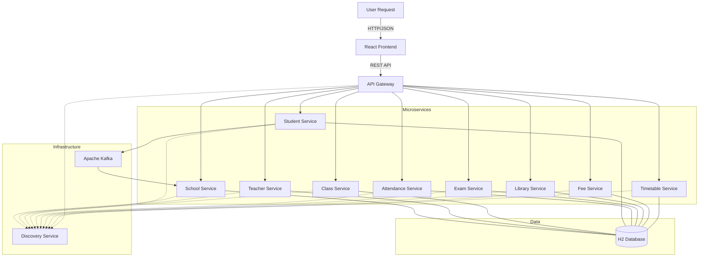
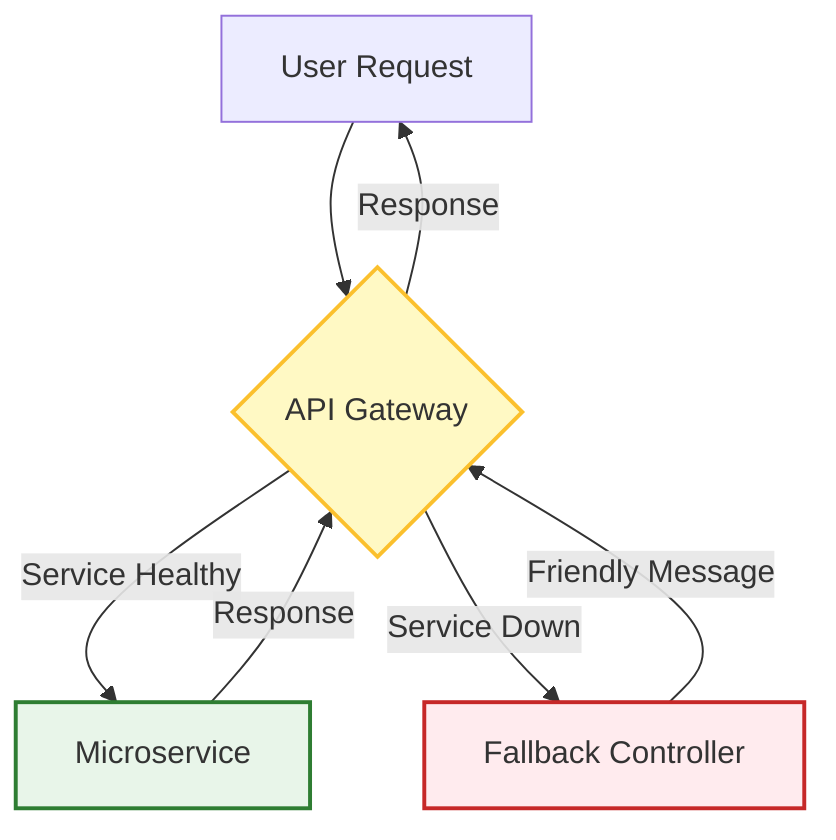

# 🎓 School Management System


A modern, full-stack web application designed to streamline school administration. Built with a **Microservices Architecture**, this system ensures scalability, fault tolerance, and a premium user experience.

---

## 📑 Table of Contents
- [Introduction](#-introduction)
- [Features](#-features)
- [Architecture](#-architecture)
- [Tech Stack](#-tech-stack)
- [Fault Tolerance](#-fault-tolerance--resilience)
- [Project Structure](#-project-structure)
- [Installation & Running](#-installation--running)
- [Usage](#-usage)
- [Contributing](#-contributing)

---

## 🚀 Introduction

The **School Management System** leverages the power of **Spring Boot** and **React** to provide a comprehensive solution for educational institutions. It moves beyond monolithic limitations by adopting a distributed microservices approach, ensuring that each component (School, Teacher, Class, Student) operates independently yet cohesively.

## ✨ Features

## ✨ Features

### 🖥️ Core Modules
-   **🔐 Secure Authentication**: Centralized security via API Gateway using Spring Security (Basic Auth).
-   **📊 Interactive Dashboard**: Real-time analytics with visual charts and quick action shortcuts.
-   **🏫 School Management**: Comprehensive CRUD for managing school details, including name, address, and contact info.
-   **👨‍🏫 Teacher Management**: Register and manage teacher profiles, assigning them to specific schools.
-   **📚 Class Management**: Organize classes, assign teachers, and manage student capacity.
-   **🎓 Student Management**: Register students, track enrollments, and view detailed student profiles.
-   **📅 Attendance Management**: Track daily student attendance and generate reports.
-   **📝 Exam Management**: Schedule exams, record marks, and generate student report cards.
-   **📖 Library Management**: Manage book inventory, issue/return books, and track due dates.
-   **💰 Fee Management**: Generate fee invoices, record payments, and track outstanding dues.
-   **🗓️ Timetable Management**: Create and manage weekly class schedules and teacher assignments.

### ⚙️ Technical Capabilities
-   **⚡ Event-Driven Architecture**: Asynchronous communication between services using **Apache Kafka** (e.g., Student registration triggers School updates).
-   **🛡️ Fault Tolerance**: Resilient system design with **Resilience4j** Circuit Breakers and Fallback mechanisms to handle service failures gracefully.
-   **🎨 Premium UI/UX**: Modern Glassmorphism design, responsive layout, and smooth animations built with React and Tailwind-like CSS.
-   **🔍 Service Discovery**: Dynamic service registration and discovery using **Netflix Eureka**, allowing services to find each other without hardcoded URLs.
-   **🚪 API Gateway**: Single entry point for all client requests, handling routing, load balancing, and cross-cutting concerns.

---

## 🏗️ Architecture

The system follows a standard Microservices pattern with an API Gateway and Service Discovery.



---

## 🛠️ Tech Stack

### Frontend
-   **Framework**: React (Vite)
-   **Language**: TypeScript
-   **Styling**: Custom CSS Variables, Lucide React Icons
-   **Charting**: Recharts
-   **Routing**: React Router DOM

### Backend
-   **Framework**: Spring Boot 3.2.0
-   **Language**: Java 17
-   **Build Tool**: Maven
-   **Database**: H2 Database (In-Memory)

### Microservices Ecosystem
-   **Service Discovery**: Netflix Eureka
-   **API Gateway**: Spring Cloud Gateway
-   **Security**: Spring Security
-   **Messaging**: Apache Kafka
-   **Resilience**: Resilience4j (Circuit Breaker)

---

## 🛡️ Fault Tolerance & Resilience

The system is designed to handle failures gracefully. If a microservice becomes unavailable, the API Gateway intercepts the failure and provides a fallback response, ensuring the user experience remains uninterrupted.



---

## 📂 Project Structure

```
school-management/
├── backend/
│   ├── discovery-service/  # Service Registry (Port 8761)
│   ├── api-gateway/        # Entry Point (Port 8080)
│   ├── school-service/     # School Management (Port 8081)
│   ├── teacher-service/    # Teacher Management (Port 8082)
│   ├── class-service/      # Class Management (Port 8083)
│   ├── student-service/    # Student Management (Port 8084)
│   ├── attendance-service/ # Attendance Management (Port 8085)
│   ├── exam-service/       # Exam Management (Port 8086)
│   ├── library-service/    # Library Management (Port 8087)
│   ├── fee-service/        # Fee Management (Port 8088)
│   └── timetable-service/  # Timetable Management (Port 8089)
├── frontend/               # React Application (Port 5173)
├── docker-compose.yml      # Kafka Infrastructure
└── README.md               # Documentation
```

---

## ⚙️ Installation & Running

### Prerequisites
-   **Java 17+**
-   **Node.js 16+**
-   **Docker Desktop** (For Kafka)

### 1. Start Infrastructure (Kafka)
```powershell
docker-compose up -d
```

### 2. Start Backend Services
Open separate terminals for each service and run:

**Discovery Service (8761)**
```powershell
cd backend/discovery-service
mvn spring-boot:run
```

**API Gateway (8080)**
```powershell
cd backend/api-gateway
mvn spring-boot:run
```

**Microservices (8081-8089)**
Run `mvn spring-boot:run` in each service directory:
-   `backend/school-service`
-   `backend/teacher-service`
-   `backend/class-service`
-   `backend/student-service`
-   `backend/attendance-service`
-   `backend/exam-service`
-   `backend/library-service`
-   `backend/fee-service`
-   `backend/timetable-service`

### 3. Start Frontend
```bash
cd frontend
npm install
npm run dev
```

---

## 🌐 Usage

1.  Visit `http://localhost:5173`.
2.  **Login Credentials**:
    -   **Username**: `admin`
    -   **Password**: `password`
3.  Explore the dashboard and management modules.

---

## 🤝 Contributing

Contributions are welcome! Please fork the repository and submit a pull request.

---

*Developed by [Bhaumiksinh](https://github.com/bhaumiksinh)*
